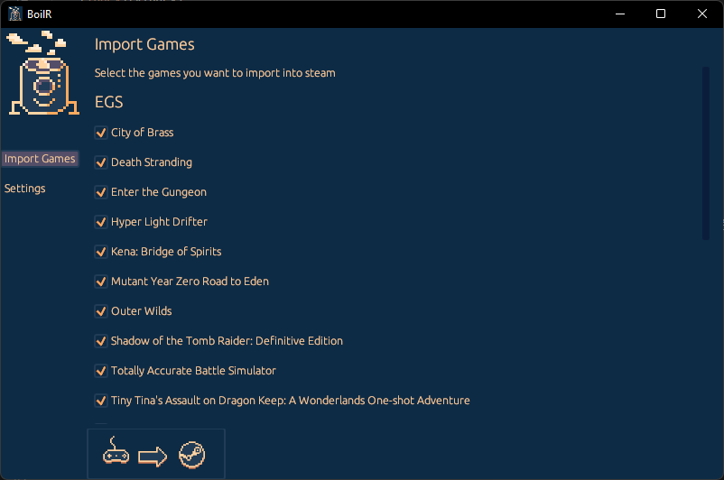

# BoilR

BoilR automatically adds (almost) all your games to your Steam library.



It uses the Steam 3rd party shortcuts feature and does not require you to set up anything.
The goal is that you do not have to leave your Steam library to launch games from other launchers/stores, so that you can find all the games that you have available.
Optionally you can set BoilR up to automatically download artwork from [SteamGridDB](https://www.steamgriddb.com/).

## Getting started
- Download the latest release from the [releases page](https://github.com/PhilipK/BoilR/releases).
- Run the executable.
- Click Import Games.
- Restart Steam to see your new shortcuts.

If you are on Linux (or a Steam Deck) you can install BoilR from [flathub](https://flathub.org/apps/details/io.github.philipk.boilr).

## Index
- [BoilR](#boilr)
  - [Getting started](#getting-started)
  - [Index](#index)
  - [Features](#features)
  - [Integrations](#integrations)
  - [Getting cover art for your shortcuts](#getting-cover-art-for-your-shortcuts)
  - [Tips](#tips)
    - [Tips for steam deck](#tips-for-steam-deck)
    - [Tips for linux](#tips-for-linux)
    - [Configuration](#configuration)
    - [Run as CLI](#run-as-cli)
  - [Contributions](#contributions)
    - [How can I help/contribute?](#how-can-i-helpcontribute)
    - [I found a bug, what do it do?](#i-found-a-bug-what-do-it-do)
    - [I have a great idea / I would like support for a specific platform, what do I do?](#i-have-a-great-idea--i-would-like-support-for-a-specific-platform-what-do-i-do)
    - [Can I donate to support BoilR?](#can-i-donate-to-support-boilr)
    - [License](#license)
  - [What is up with the name BoilR?](#what-is-up-with-the-name-boilr)


## Features

- [x] Show games from other platforms in your steam library
- [x] Automatically download art from [SteamGridDB](https://www.steamgriddb.com/)
- [x] Cross Platform (Windows, Linux, Mac, Steam Deck)
- [x] Standalone / No install needed
- [x] Small (~3mb on disk)
- [x] Lightweight (~30mb ram)
- [x] Fast synchronization (~1 second)

## Integrations

- [x] [Epic Games Store](https://www.epicgames.com/)
- [x] [Itch.io](https://itch.io/app)
- [x] [Origin](https://www.origin.com)
- [x] [GOG](https://www.gog.com/galaxy)
- [x] [UPlay](https://ubisoftconnect.com)
- [x] [Lutris](https://github.com/lutris/lutris)
- [x] [Legendary](https://github.com/derrod/legendary)
- [x] [Rare](https://github.com/Dummerle/Rare/releases)
- [x] [Heroic Launcher](https://github.com/Heroic-Games-Launcher/HeroicGamesLauncher) (Linux Only)
- [x] [Amazon Games](https://gaming.amazon.com) (Windows Only)
- [ ] XBox/Microsoft Store integration


## Getting cover art for your shortcuts

- Get a [SteamGridDB API key](https://www.steamgriddb.com/profile/preferences/api)
- Run BoilR
- Put the auth key in the input in the settings
- Click "Import games"


## Tips 

### Tips for steam deck

I currently don't have a steam deck, which slows down development for it a bit.
There might still be problems specific to the deck, so if you run into one please check the issues.

If you have a problem that a game wont launch, try to manually set a proton version for it.

### Tips for linux

If you are running linux (this includes Steam Dekc) and are running into problems check [tips for linux seciton](tips_for_linux.md)

### Configuration

Most people will not have to configure anything, just open BoilR and click Synchronize, but it is possible to configure a lot, see the [configuration section](configuration.md)

### Run as CLI

In previous releases there was both a CLI and UI version of BoilR, now there is only a UI version.
But you can add the commandline argument ``--no-ui`` and then the UI version will act like the old CLI version.
This saves some CO2 from not having to build 2 versions of BoilR for each platform, and it also makes development easier.

## Contributions 

### How can I help/contribute?
If you are a coder, you can fork this repo and then create a pull request, they are very welcome!
To run BoilR just write:

```shell
cargo run
```

If you are not a developer (or you don't like to code in Rust) spread the work and create issues/discussions for anything.

### I found a bug, what do it do?
Check that there is not already an issue for it [here](https://github.com/PhilipK/BoilR/issues)
If not, create a new issue and I will have a look at it (remember to write which OS you are using).

### I have a great idea / I would like support for a specific platform, what do I do?
Check out the [discussions](https://github.com/PhilipK/BoilR/discussions) and feel free to create new discussions for your idea.


### Can I donate to support BoilR?
Nope, please don't, donate it to your favorite charity instead, and if you don't have one of those may I suggest something like [GiveWell](https://www.givewell.org/).

### License
This project is dual license MIT or Apache 2.0 , it is up to you. In short, you can do what you want with this project, but if in doubt read the license files.

## What is up with the name BoilR?
This tool turns things into Steam, therefor boiler, And it is written in **R**ust so therefor: BoilR
