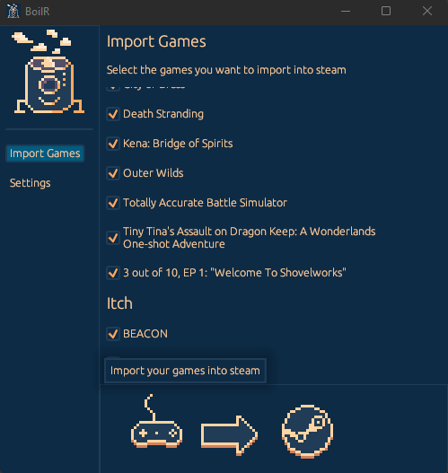

# BoilR

BoilR automatically adds (almost) all your games to your Steam library (including image art).




It uses the Steam 3rd party shortcuts feature and does not require you to set up anything.
The goal is that you do not have to leave your Steam library to launch games from other launchers/stores, so that you can find all the games that you have available.
Optionally, you can set up BoilR to automatically download artwork from [SteamGridDB](https://www.steamgriddb.com/).

## Getting started
- Download the latest release from the [releases page](https://github.com/PhilipK/BoilR/releases).
- Run the executable. 
    - if you are on a Steam Deck, right click and mark it "executable" under properties
- Click Import Games.
- Restart Steam to see your new shortcuts.

If you are on Linux (or a Steam Deck) you can install BoilR from [flathub](https://flathub.org/apps/details/io.github.philipk.boilr).
Be aware that the flatpak version has some limitations compared to the native version.
There is also an [AUR package](https://aur.archlinux.org/packages/steam-boilr-gui)

## Index
- [BoilR](#boilr)
  - [Getting started](#getting-started)
  - [Index](#index)
  - [Features](#features)
  - [Integrations](#integrations)
  - [Getting cover art for your shortcuts](#getting-cover-art-for-your-shortcuts)
  - [Tips](#tips)
    - [Tips for Linux](#tips-for-linux)
    - [Configuration](#configuration)
    - [Run as CLI](#run-as-cli)
    - [Rename shortcuts](#rename-shortcuts)
    - [Try the native version over the flatpak](#try-the-native-version-over-the-flatpak)
  - [Contributions](#contributions)
    - [How can I help/contribute?](#how-can-i-helpcontribute)
    - [I found a bug, what do I do?](#i-found-a-bug-what-do-i-do)
    - [I have a great idea / I would like support for a specific platform, what do I do?](#i-have-a-great-idea--i-would-like-support-for-a-specific-platform-what-do-i-do)
    - [Can I donate to support BoilR?](#can-i-donate-to-support-boilr)
    - [License](#license)
  - [What is up with the name BoilR?](#what-is-up-with-the-name-boilr)


## Features

- [x] Show games from other platforms in your steam library
- [x] Automatically download art from [SteamGridDB](https://www.steamgriddb.com/)
- [x] Customize your Steam games art
- [x] Backup your shortcuts
- [x] Cross Platform (Windows, Linux, Mac, Steam Deck)
- [x] Standalone / No install needed
- [x] Small (~3mb on disk)
- [x] Lightweight (~30mb ram)
- [x] Fast synchronization (~1 second)

## Integrations

BoilR can import games from many platforms, but there are limitations:

| Platforms                                                                       | Windows | Linux (executable)            | Linux (flatpak)                           |
| ------------------------------------------------------------------------------- | ------- | ----------------------------- | ----------------------------------------- |
| [Epic Games Store](https://www.epicgames.com/)                                  | Yes     | Yes, install through proton   | Yes, install through proton               |
| [Itch.io](https://itch.io/app) (Windows Games)                                  | Yes     | No                            | No                                        |
| [Itch.io](https://itch.io/app) (Linux Games)                                    | No      | Yes                           | Yes                                       |
| [Origin](https://www.origin.com)                                                | Yes     | Yes, install through proton   | Yes, install through proton               |
| [GOG](https://www.gog.com/galaxy)                                               | Yes     | No (Use Heroic or MiniGalaxy) | No (Use Heroic or MiniGalaxy)             |
| [UPlay](https://ubisoftconnect.com)                                             | Yes     | Yes                           | Yes                                       |
| [Lutris](https://github.com/lutris/lutris) (Flatpak)                            | No      | Yes                           | Yes (make sure Lutris is shut down first) |
| [Lutris](https://github.com/lutris/lutris) (Non-Flatpak)                        | No      | Yes                           | Yes                                       |
| [Legendary](https://github.com/derrod/legendary)                                | No      | Yes                           | Yes                                       |
| [Rare](https://github.com/Dummerle/Rare/releases)                               | No      | Yes                           | Yes                                       |
| [Heroic Launcher](https://github.com/Heroic-Games-Launcher/HeroicGamesLauncher) | No      | Yes                           | Yes                                       |
| [Amazon Games](https://gaming.amazon.com)                                       | Yes     | No                            | No                                        |
| [Flatpaks](https://flathub.org/)                                                | No      | Yes                           | Yes                                       |
| [Bottles](https://usebottles.com/)                                              | No      | Yes                           | Yes                                       |
| [MiniGalaxy](https://sharkwouter.github.io/minigalaxy/)                         | No      | Yes                           | Yes                                       |
| [Playnite](https://playnite.link/)                                              | Yes     | No                            | No                                        |
| [Game Pass](https://www.xbox.com/en-US/xbox-game-pass)                          | Yes     | No                            | No                                        |

## Getting cover art for your shortcuts

- Get a [SteamGridDB API key](https://www.steamgriddb.com/profile/preferences/api)
- Run BoilR
- Put the auth key in the input in the settings
- Click "Import games"


## Tips 

### Tips for Linux

If you are running Linux (this includes Steam Deck) and are running into problems check [tips for Linux section](tips_for_linux.md)

### Configuration

Most people will not have to configure anything, just open BoilR and click Import Games, but it is possible to configure a lot, see the [configuration section](configuration.md)

### Run as CLI

In previous releases there was both a CLI and UI version of BoilR, now there is only a UI version.
But you can add the commandline argument ``--no-ui`` and then the UI version will act like the old CLI version.
This saves some CO2 from not having to build 2 versions of BoilR for each platform, and it also makes development easier.

### Rename shortcuts

You can rename a shortcut from BoilR by double clicking it from the import list and picking a new name.
If you want to revert back to the original name, just clear the name and click rename.

### Try the native version over the flatpak

In general, the native (downloaded form the releases page) version of BoilR is the more reliable one.
If you experience bugs or errors please try the native version and see if that fixes your problem.

## Contributions 

### How can I help/contribute?
If you are a coder, you are very welcome! You can fork this repo and then create a pull request.

To check formats and errors of code before running the code:

```shell
cargo fmt

cargo check
```

To run BoilR just write:

```shell
cargo run
```

If you are not a developer (or you don't like to code in Rust) do spread the work and create issues/discussions for anything.

### I found a bug, what do I do?
Check that there is not already an issue for it [here](https://github.com/PhilipK/BoilR/issues)
If not, create a new issue and I will have a look at it (remember to write which OS you are using).

### I have a great idea / I would like support for a specific platform, what do I do?
Check out the [discussions](https://github.com/PhilipK/BoilR/discussions) and feel free to create new discussions for your idea.


### Can I donate to support BoilR?
Nope, please don't, donate it to your favorite charity instead, and if you don't have one of those may I suggest something like [GiveWell](https://www.givewell.org/).

### License
This project is dual license MIT or Apache 2.0 , it is up to you. In short, you can do what you want with this project, but if in doubt read the license files.

## What is up with the name BoilR?
This tool turns things into Steam, therefore boiler, And it is written in **R**ust, so therefore: BoilR
